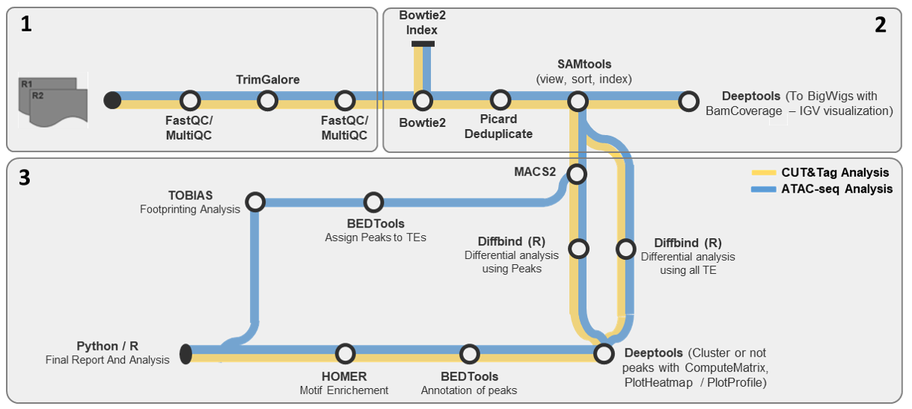

This is a pipeline for the analysis of Cut&Tag and ATAC-seq data. The pipeline is based on the [Snakemake](https://snakemake.readthedocs.io/en/stable/) workflow. The pipeline is designed to take raw fastq files as input and produce a variety of outputs including alignment files, peak files, and quality control reports...

## Table of Contents
- [Table of Contents](#table-of-contents)
- [Description of the pipeline](#description-of-the-pipeline)
- [Prerequisites](#prerequisites)
    - ["Easy" mode :](#easy-mode-)
    - ["Hard" mode :](#hard-mode-)
- [Installation](#installation)
- [Configuration](#configuration)
  - [Parameters](#parameters)
  - [Design matrix](#design-matrix)
- [Usage](#usage)
- [Output](#output)

## Description of the pipeline

The pipeline is divided into three steps:
1. `Quality control` : This step generates fastqc reports for each fastq file, and a multiqc report summarizing the fastqc reports.
You must then check the multiqc report to ensure the quality of the fastq files, and decide if any trimming is required. Then you can edit the configuration file to set whether or not you want to trim the fastq files.
2. `Mapping and BAM files manipulation` : This step aligns the fastq files to the reference genome, which can either already be indexed, in which case you can set the path to the index, or the pipeline will index the reference genome, in this case you must set the path to the reference genome in fasta format. The pipeline then sorts the alignment files, removes duplicates, and indexes the bam files...
3. `Downsampling, peak calling, and more` : This step downsamples the alignment files, calls peaks using macs2, and generates bigwig files using deepTools. It also generates a diffbind input matrix and counts the reads in the peaks and gives an rdata file with the dba object.

## Prerequisites
> **Note** : Fastq files need to include **R1** and **R2** in the file names. The pipeline considers the SampleID to be the part of the file name before the first "_R1" or "_R2". For example, if the file name is `Sample1_R1_001.fastq.gz`, the SampleID will be `Sample1`.

> **Note** : Pipeline only works for **paired-end** data. And has only been tested on **Linux systems**.


#### "Easy" mode :

The pipeline can be run using a docker/singularity image. The docker/singularity image contains all the required tools and dependencies.
In this case only [Snakemake](https://snakemake.readthedocs.io/en/stable) is required.

#### "Hard" mode :
One can also choose not to use the singularity image, in which case the following tools are required to run the pipeline:
- [Snakemake](https://snakemake.readthedocs.io/en/stable) (<= 8.0.1)
- [bowtie2](https://bowtie-bio.sourceforge.net/bowtie2/manual.shtml)
- [samtools](http://www.htslib.org/download/)
- [bedtools](https://bedtools.readthedocs.io/en/latest/)
- [picard](https://broadinstitute.github.io/picard/)
- [macs2](https://pypi.org/project/MACS2/)
- [deepTools](https://deeptools.readthedocs.io/en/latest/)
- [fastqc](https://www.bioinformatics.babraham.ac.uk/projects/fastqc/)
- [multiqc](https://multiqc.info/)
- [TOBIAS](https://github.com/loosolab/TOBIAS)
- [R](https://www.r-project.org/), with :
  - [ggplot2](https://ggplot2.tidyverse.org/)
  - [dplyr](https://dplyr.tidyverse.org/)
  - [tidyverse](https://www.tidyverse.org/)
  - [DiffBind](https://bioconductor.org/packages/release/bioc/html/DiffBind.html)

NB: Rebuilding the singularity image is possible, these, are required:
- [Docker](https://www.docker.com/)
- [Singularity](https://sylabs.io/guides/3.5/user-guide/installation.html)

The files used to build the images are available [here](docker/).

## Installation
To install the pipeline, you can clone the repository using the following command:
```bash
git clone https://github.com/xxxxxx/xxxxxxxxxxx.git
cd xxxxxxxxxxx
```
No further installation is required. Unless one wishes to edit and rebuild the docker/singularity image, in which case the following commands can be used:
```bash
docker build -f "/path/to/Dockerfile" -t container
docker save container 
singularity build container.sif container
# or
singularity build container.sif /path/to/singularity.def
```

## Configuration
A [configuration file](/Cut&Tag/config/config_file.yaml) in `yaml` format is required to run the pipeline. It is included, and should be edited to include the experiment name, paths to the input fastq files, the reference genome, etc. 

A [design matrix file](/Cut&Tag/config/design_template.csv) in `csv` format is also required to run the pipeline, a template can be found at `config/design_matrix_template.csv`. The design matrix file should be edited to include at least the sample names, the conditions, and the replicates. Other fields are optional and any number of fields can be added. 

### Parameters

| Parameter          | Type    | Description                                           |
|--------------------|---------|-------------------------------------------------------|
| run_name           | String  | The name of the experiment/project                    |
| working_directory  | String  | The path to the working directory where the output files should be saved |
| path_to_raw_data   | String  | The path to the folder containing the raw fastq files |
| design_matrix      | String  | The path to the design matrix file                    |
| genome             | String  | The reference genome to use. Available options : `hg19`, `mm10` |
| path_to_genome_fasta | String | The path to the reference genome in fasta format, **only relevant if the genome is to be indexed by the pipeline** |
| nbCores_(tool)     | Integer | (> 0) The number of cores to use for each tool        |
| available_memory   | Integer | (> 0) The amount of memory available for the pipeline, in GB |
| available_cores    | Integer | (> 0) The number of cores available for the pipeline  |
| delete_tmp_files   | Bool    | Whether or not to delete intermediate files           |
| atac_seq           | Bool    | Whether or not the data is ATAC-seq                   |
fastqc_args          | String  | Additional arguments to pass to fastqc                |
| trim_data          | Bool    | Whether or not to trim the fastq files                |
| adapter            | String  | The adapter sequence to use for trimming, if not provided, the pipeline will try to auto-detect it. Options : `illumina`, `stranded_illumina`, `nextera`, `small_rna` |
| index_genome       | Bool    | Whether or not to index the reference genome          |
| path_to_bowtie2_genome_idx | String | The path to the bowtie2 index of the reference genome, **only relevant if the genome is NOT to be indexed by the pipeline** |
| remove_duplicates  | Bool    | Whether or not to remove duplicates                   |
| output_finale_file_with_duplicates | Bool | Whether or not to also output BAM files with duplicates, **only relevant if `remove_duplicates` is set to `True`** |
| MAPQ               | Integer or List | (>=0) One or more MAPQ values to filter the reads by, can be a single value, i.e. `2`, or a list of values, i.e. `[0, 2, 4]` |
| keep_only_regular_reads | Bool | Whether or not to keep only regular reads. Depends on the genome used, i.e. `hg19` or `mm10` |
| downsample         | Bool    | Whether or not to downsample the alignment files      |
| downsample_type    | String  | The type of downsampling to use. Available options : `ALL`, `By-group` |
| downsample_column  | String  | The column in the design matrix to use for downsampling, **only relevant if `downsample_type` is set to `By_group`**. Options : `Tissue`, `Factor`, `Condition`, `Treatment`, `Replicate`. (Or any other optional column added) |
| downsample_specific_group | String | The group to use for downsampling, **only relevant if `downsample_type` is set to `By_group`**|
| convert_to_BigWig  | Bool    | Whether or not to convert the BAM files to BigWig files |
| peak_calling       | Bool    | Whether or not to call peaks                          |
| macs2_parameters        | String  | Additional parameters to pass to MACS2           |
| diffbind           | Bool    | Whether or not to create the input matrix for diffbind and run diffbind to generate an RData, PCA and Volcano plots |
| diffbind_pvalue    | Float   | The p-value to use for diffbind, only relevant if `diffbind` is set to `True` |
| diffbind_flip      | Bool    | Whether or not to flip the fold change sign, only relevant if `diffbind` is set to `True` |
| user_peaks         | String  | Path to the user peaks file, **only relevant if `diffbind` is set to `True`**, and user peaks are to be used, empty string to use the peaks called by the pipeline |
| user_peak_caller   | String  | The peak caller used to generate the user peaks, **only relevant if `diffbind` is set to `True`**, and user peaks are to be used, empty string otherwise |
| path_to_regions    | String  | The path to the regions to use for peak annonation    |
| compute_matrix     | Bool    | Whether or not to compute the matrix                  |
| compute_matrix_type| String  | The type of matrix to compute, available options : `reference-point` or `scale-regions` |
| upstream           | Integer | Distance upstream of the start site of the regions defined in the region file |
| downstream         | Integer | Distance downstream of the end site of the regions defined in the region file |
| compute_matrix_parameters | String | Additional parameters to pass to the matrix computation tool |
| specific_regions   | String  | to only use specific regions for the matrix computation, i.e. `promoters`, `L1Md`, etc. |
| plot_heatmap       | Bool    | Whether or not to plot the heatmap                    |
| plot_heatmap_parameters | String | Additional parameters to pass to the heatmap plotting tool |
| plot_profile       | Bool    | Whether or not to plot the profile                    |
| plot_profile_parameters | String | Additional parameters to pass to the profile plotting tool |
| custom_regions     | String  | Path to a bed file containing custom regions to use for the matrix computation and plotting |
| run_tobias         | Bool    | Whether or not to run TOBIAS                          |
| nbcores_tobias     | Integer | The number of cores to use for TOBIAS                 |
| motifs             | String  | Path to the motifs to use for TOBIAS (all motifs must be in the same file)                  |
| blacklist          | String  | Path to the blacklist regions to use for TOBIAS        |
| uropa_config       | String  | Path to the UROPA configuration file,example config is provided [here](config/uropa_config.json), and keys and values should be edited as needed |

  > **Note:** Paths to directories/folders should not have a trailing "/" at the end

  > **Note:** For trimming, the optimal number of cores is **4**, anything above has diminishing returns. ***If more than 4 cores are specified, the pipeline will default to 4 cores***.

  > From [trim_galore documentation](https://github.com/FelixKrueger/TrimGalore): Actual core usage: It should be mentioned that the actual number of cores used is a little convoluted. Assuming that Python 3 is used and pigz is installed, --cores 2 would use 2 cores to read the input (probably not at a high usage though), 2 cores to write to the output (at moderately high usage), and 2 cores for Cutadapt itself + 2 additional cores for Cutadapt (not sure what they are used for) + 1 core for Trim Galore itself. So this can be up to 9 cores, even though most of them won't be used at 100% for most of the time. Paired-end processing uses twice as many cores for the validation (= writing out) step. --cores 4 would then be: 4 (read) + 4 (write) + 4 (Cutadapt) + 2 (extra Cutadapt) + 1 (Trim Galore) = 15.

### Design matrix
The design matrix file should be in `csv` format, and should include at least the following columns: `SampleID`, `Tissue`, `Factor`, `Condition`, `Treatment`, `Replicate`. 

Other optional columns can be included, such as: `Mark`, `Species`, `Cells`, `Sexe`...

## Usage
The pipeline is run in three steps, with one snakefile for each step. 
Each step can be run with the following command:
```bash
snakemake -s snakefile --configfile config/config.yaml --cores 16 
```
- To run with singularity:
```bash
snakemake -s snakefile --cores 16 --configfile config/config.yaml --use-singularity
```

## Output

After running all three steps, the following folders and files will be generated:

| Folder/File            | Description                                                                                   |
|------------------------|-----------------------------------------------------------------------------------------------|
| `trimmed_fastq/`       | Contains the trimmed FASTQ files, if trimming was enabled.                                    |
| `idx/`                 | Contains the indexed reference genome, if indexing was enabled.                               |
| `BAM/`                 | Contains the alignment files in BAM format.                                                   |
| `fastqc_reports/`      | Contains the FASTQC reports for each FASTQ file.                                              |
| `multiqc_report_data/` | Contains the MultiQC report data generated from the FASTQC reports.                           |
| `stats/`               | Contains the alignment statistics for each sample.                                            |
| `stats/summary/`       | For each condition, contains an Excel file with the alignment statistics for all samples.     |
| `peak_calling/`        | Contains the peak files generated by MACS2.                                                   |
| `bigwig/`              | Contains the BigWig files generated by deepTools.                                             |
| `diffbind/`            | Contains the DiffBind input matrix and an RData file with the DBA object after counting.      |
| `commands/`            | Contains commands used to downsample.                                                         |
| `DS/`                  | Contains downsampled BAM files.                                                               |
| *config_files*         | For each step, a TXT file with the parameters and details of the run is generated.            |
| *Run_Report.html*      | An html report summarizing the run.                                                           |