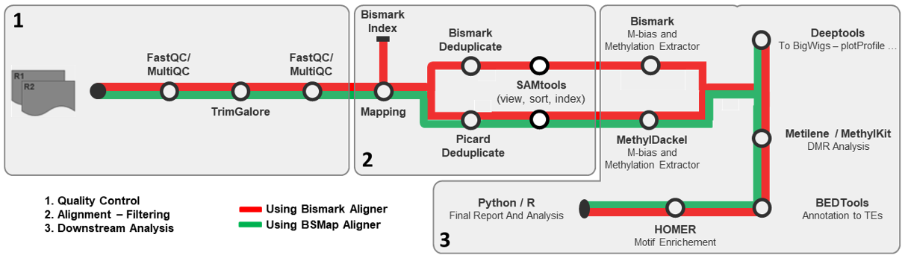

This is a pipeline for the analysis of WGBS data. The pipeline is based on the [Snakemake](https://snakemake.readthedocs.io/en/stable/) workflow. The pipeline is designed to take raw fastq files as input and produce a variety of outputs including alignment files, peak files, and quality control reports...

## Table of Contents
- [Table of Contents](#table-of-contents)
- [Pipeline Description](#pipeline-description)
- [Pre-requisites](#pre-requisites)
    - ["Easy" mode :](#easy-mode-)
    - ["Hard" mode :](#hard-mode-)
- [Installation](#installation)
- [Configuration](#configuration)
  - [Parameters](#parameters)
  - [Design matrix](#design-matrix)
- [Usage](#usage)
- [Output](#output)

## Pipeline Description



The pipeline is divided into three main parts: quality control, alignment and BAM filtering, and downstream analysis. 
The quality control step inlude adapter trimming and filtering of low-quality reads. Alignment to the reference genome is done using either bismark (for unique analysis) or BSMap (for multimapping analysis). Alignement is followed by filtering, sorting, indexing and downsmapling of the alignment file. Downstream analysis include methylation calling, filtering of low coverage sites, visualization of the methylation profile, detection of DMRs, ... 

The pipeline can either be run on a local machine or on a cluster. It is recommended to run the pipeline on a cluster for large datasets, using the docker/singularity container.

## Pre-requisites

> **Note** : Fastq files need to include **R1** and **R2** in the file names. The pipeline considers the SampleID to be the part of the file name before the first "_R1" or "_R2". For example, if the file name is `Sample1_R1_001.fastq.gz`, the SampleID will be `Sample1`.

> **Note** : Pipeline only works for **paired-end** data. And has only been tested on **Linux systems**.

> **Note:** Only the mm10 and hg38 reference genomes are supported.

#### "Easy" mode :

The pipeline can be run using a docker/singularity image. The docker/singularity image contains all the required tools and dependencies.
In this case only [Snakemake](https://snakemake.readthedocs.io/en/stable) is required (Developed and tested using Snakemake v8.0.1).

#### "Hard" mode :
One can also choose not to use the singularity image, in which case the following tools are required to run the pipeline:
- [Snakemake](https://snakemake.readthedocs.io/en/stable)
- [bismark](https://felixkrueger.github.io/Bismark/)
- [bowtie2](https://bowtie-bio.sourceforge.net/bowtie2/manual.shtml)
- [samtools](http://www.htslib.org/download/)
- [BSMap](https://code.google.com/archive/p/bsmap/)
- [bedtools](https://bedtools.readthedocs.io/en/latest/)
- [picard](https://broadinstitute.github.io/picard/)
- [macs2](https://pypi.org/project/MACS2/)
- [deepTools](https://deeptools.readthedocs.io/en/latest/)
- [fastqc](https://www.bioinformatics.babraham.ac.uk/projects/fastqc/)
- [multiqc](https://multiqc.info/)
- [Metilene](http://legacy.bioinf.uni-leipzig.de/Software/metilene/)
- [R](https://www.r-project.org/), with :
  - [ggplot2](https://ggplot2.tidyverse.org/)
  - [dplyr](https://dplyr.tidyverse.org/)
  - [tidyverse](https://www.tidyverse.org/)
  - [DiffBind](https://www.bioconductor.org/packages/release/bioc/html/DiffBind.html)
  - [methylKit](https://www.bioconductor.org/packages/release/bioc/html/methylKit.html)


NB: Rebuilding the singularity image is possible, these, are required:
- [Docker](https://www.docker.com/)
- [Singularity](https://sylabs.io/guides/3.5/user-guide/installation.html)

The files used to build the images are available [here](docker/).

## Installation
To install the pipeline, you can clone the repository using the following command:
```bash
git clone https://github.com/HassanAit128/Snake_pipes_pub.git
cd WGBS/
```
No further installation is required. Unless one wishes to edit and rebuild the docker/singularity image, in which case the following commands can be used:
```bash
docker build -f "/path/to/Dockerfile" -t container
docker save container 
singularity build container.sif container
# or
singularity build container.sif /path/to/singularity.def
```

## Configuration
A [configuration file](Config/config.yaml) in `yaml` format is required to run the pipeline. It is included, and should be edited to include the experiment name, paths to the input fastq files, the reference genome, etc. 

A [design matrix file](Config/design_template.csv) in `csv` format is also required to run the pipeline, a template can be found at `config/design_matrix_template.csv`. The design matrix file should be edited to include at least the sample names, the conditions, and the replicates. Other fields are optional and any number of fields can be added. 

### Parameters
| Parameter          | Type    | Required | Description                                           |
|--------------------|---------|----------|-------------------------------------------------------|
|||||
| name               | string  | Yes      | Name of the project/analysis                          |
| working_dir        | string  | Yes      | Path to the working directory                         |
| raw_data_dir       | string  | Yes      | Path to the directory containing the raw fastq files  |
| design_matrix      | string  | Yes      | Path to the design matrix file                        |
|||||
| fastqc_args        | string  | No       | Additional arguments for FastQC                       |
| run_trimming       | bool    | Yes      | Whether to run trimming and cleaning of the reads     |
| trim_galore_cores  | int     | No       | Number of cores to use for Trim Galore                |
| trim_galore_args   | string  | No       | Additional arguments for Trim Galore                  |
|||||
| genome             | string  | Yes      | Reference genome <span style="color: blue;">**(mm10, hg38)**</span>                         |
| path_to_genome_fasta | string | Yes     | Path to the reference genome fasta file               |
| alignment_tool     | string  | Yes      | Alignment tool to use <span style="color: blue;">**(bismark, bsmap)**</span>                |
| run_indexing       | bool    | Yes      | Whether to run indexing of the reference genome. <span style="color: red;">*Only relevant if using **bismark***.</span> |
| path_to_bismark_idx | string | No       | Path to the bismark index files if **run_indexing is set to False**. <span style="color: red;">*Only relevant if using **bismark***.</span> |
| bismark_cores      | int     | No       | Number of cores to use for bismark. <span style="color: red;">*Only relevant if using **bismark***.</span>|
| bismark_args       | string  | No       | Additional arguments for bismark. <span style="color: red;">*Only relevant if using **bismark***.</span>|     
| bsmap_mode         | string  | Yes      | Mode to use for bsmap (unique, all). <span style="color: red;">*Only relevant if using **bsmap**.*</span>|
| bsmap_cores        | int     | No       | Number of cores to use for bsmap. <span style="color: red;">*Only relevant if using **bsmap**.*</span>|
| bsmap_args         | string  | No       | Additional arguments for bsmap. <span style="color: red;">*Only relevant if using **bsmap**.*</span>|
| samtools_cores     | int     | No       | Number of cores to use for samtools. |
| deduplication_tool | string  | Yes      | Deduplication tool to use <span style="color: blue;"> **(picard, bismark)**.</span>|
| picard_args        | string  | No       | Additional arguments for picard. <span style="color: red;">*Only relevant if using **picard***.</span>|
| bismark_deduplication_args | string | No | Additional arguments for bismark deduplication. <span style="color: red;">*Only relevant if using **bismark***.</span>|
| run_downsampling   | bool    | Yes      | Whether to run downsampling of the alignment file.|
| blacklist_regions  | string  | *Not implemented yet* | Path to the blacklist regions file.|
|||||
| methylation_caller | string  | Yes      | Methylation caller to use <span style="color: blue;">**(bismark, methyldackel)**</span>.  |
| run_methylation_bias_check | bool | Yes | Whether to run methylation bias check.|
| stop_after_m_bias_check | bool | Yes | Whether to stop after methylation bias check. <span style="color: red;">*Irrelevent if auto_ignore for **Methyldackel** is set to true.*</span> | 
| run_methylation_calling | bool | Yes | Whether to run methylation calling.|
| bismark_methylation_cores | int | No | Number of cores to use for bismark methylation calling. <span style="color: red;">*Only relevant if using **bismark***.</span> |
| bismark_methylation_args | string | No | Additional arguments for bismark methylation calling. <span style="color: red;">*Only relevant if using **bismark***.</span> |
| R1_5prime_ignore | int | No | Number of bases to ignore at the 5' end of R1. <span style="color: red;">*Only relevant if using **bismark***.</span>  |
| R1_3prime_ignore | int | No | Number of bases to ignore at the 3' end of R1. <span style="color: red;">*Only relevant if using **bismark***.</span>  |
| R2_5prime_ignore | int | No | Number of bases to ignore at the 5' end of R2. <span style="color: red;">*Only relevant if using **bismark***.</span>  |
| R2_3prime_ignore | int | No | Number of bases to ignore at the 3' end of R2. <span style="color: red;">*Only relevant if using **bismark***.</span>  |
| methyldackel_cores | int | No | Number of cores to use for methyldackel. <span style="color: red;">*Only relevant if using **methyldackel***.</span>  |
| methyldackel_mbias_args | string | No | Additional arguments for methyldackel mbias. <span style="color: red;">*Only relevant if using **methyldackel***.</span>  |
| methyldackel_args | string | No | Additional arguments for methyldackel. <span style="color: red;">*Only relevant if using **methyldackel***.</span>  |
| also_methylkit | bool | No | Whether to run methyldackel with methylkit. <span style="color: red;">*Only relevant if using **methyldackel***.</span>  |
| auto_ignore | bool | Yes | Whether to ignore OT and OB values. <span style="color: red;">*Only relevant if using **methyldackel**. Also overrides **stop_after_m_bias_check**.*</span>  |
| OT_ignore | int | No | OT values to ignore. <span style="color: red;">*Only relevant if using **methyldackel***.</span>  |
| OB_ignore | int | No | OB values to ignore. <span style="color: red;">*Only relevant if using **methyldackel***.</span>  |
| run_DMR_analysis | bool | Yes | Whether to run DMR analysis.  |
| DMR_analysis_tool | string | Yes | DMR analysis tool to use <span style="color: blue;"> **(metilene, methylkit)**.</span>  |
| minimum_coverage | int | No | Minimum read coverage for DMR analysis.|
| path_to_metilene | string | No | Path to the metilene executable. <span style="color: red;">*Only relevant if using **metilene***.</span>  |
| metilene_cores | int | No | Number of cores to use for metilene. <span style="color: red;">*Only relevant if using **metilene***.</span>  |
| maxdist | int | No | Maximum distance between CpGs to be considered in the same DMR. <span style="color: red;">*Only relevant if using **metilene***.</span>  |
| mincpgs | int | No | Minimum number of CpGs in a DMR. <span style="color: red;">*Only relevant if using **metilene***.</span>  |
| minMethDiff | float | No | Minimum methylation difference for a DMR. <span style="color: red;">*Only relevant if using **metilene***.</span>  |
| cleanup | bool | Yes | Whether to cleanup intermediate files.  |


  > **Note:** Paths to directories/folders should not have a trailing "/" at the end

  > **Note:** For trimming, the optimal number of cores is **4**, anything above has diminishing returns. ***If more than 4 cores are specified, the pipeline will default to 4 cores***.

### Design matrix
The design matrix file should be in `csv` format, and should include at least the following columns: `SampleID`,`Condition`, `Replicate`.

Other optional columns can be included, such as: `Treatement`, `Species`, `Cells`, `Sexe`...

## Usage
Each Snakefile can be run with the following command:
```bash
snakemake -s snakefile --configfile config/config.yaml --cores 16 
```
To run with singularity:
```bash
snakemake -s snakefile --cores 16 --configfile config/config.yaml --use-singularity
```

## Output

After running all three steps, the following folders and files will be generated:

| Folder/File             | Description                                                                                     |
|-------------------------|-------------------------------------------------------------------------------------------------|
| `TRMMED_READS/`         | Folder containing the trimmed and cleaned reads.                                                |
| `IDX_GENOME/`           | Folder containing the indexed genome if pipeline was run with Bismark and Indexing set to true  |
| `ALIGN_BAM/`            | Folder containing the alignment files.                                                          |
| `BAMs/`                 | Folder containing the filtered, sorted, indexed, deduplicated and downsampled BAM files.        |
| `METHYLATION/`          | Folder containing the methylation calling files.                                                |
| `METHYLATION/METHYLATION_BIAS/` | Folder containing the methylation bias check files.                                     |
| `FINAL_REPORT/`         | Folder containing the final reports.                                                            |
| `DMR_ANALYSIS/`         | Folder containing the DMR analysis files.                                                       |
| `LOGS/`                 | Folder containing the log files.                                                                |
| `REPORTS/`              | Folder containing various reports, including FastQC, MultiQC, alignment, methylation, ...       |
| *config.txt*           | Configuration used for the run.                                                                 |
| *Run_Report.html*       | An html report summarizing the run.                                                             |
